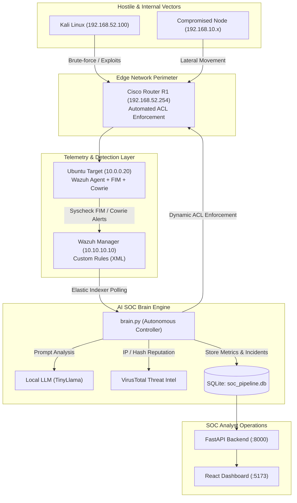

# AI-Driven SOC Automation Pipeline with Adaptive Deception Environments

[](https://opensource.org/licenses/MIT)
[](https://www.python.org/)
[](https://fastapi.tiangolo.com/)
[](https://react.dev/)
[](https://wazuh.com/)
[](https://ollama.com/)
[](#research-reproducibility)

> **Research Thesis Project:** *Proactive SIEM System Based on Adaptive Deception Environments Built with Artificial Intelligence*  
> **Arabic Title:** نظام SIEM استباقي قائم على بيئات خداع تكيفية مبنية بالذكاء الاصطناعي  
> **Authors:** Hassan Ahmed Oheda ([hassanoheda66@gmail.com](mailto:hassanoheda66@gmail.com)) & Malik Mohammed Abu Lseen  
> **Academic Supervisor:** Dr. Idris Ghmayed  
> **Institution:** Department of Networks, Faculty of Information Technology, University of Tripoli (Spring 2026)

---

## 📌 Executive Abstract

Modern enterprise Security Information and Event Management (SIEM) systems suffer from structural limitations when defending against advanced insider threats and zero-day intrusions. Traditional reactive architectures rely heavily on static signatures, suffering from high false-positive fatigue, lack of contextual awareness, and manual mitigation bottlenecks.

This repository presents the reference implementation of an **Autonomous, Proactive AI-Driven SOC Pipeline**. The platform orchestrates three complementary defense layers:
1. **Intelligent Detection Layer:** Wazuh SIEM integrated with Suricata IDS and File Integrity Monitoring (FIM).
2. **Automated Cognitive Layer (`brain.py`):** Real-time alert enrichment using a local Small Language Model (SLM - TinyLlama via Ollama), VirusTotal threat intelligence, and automated CIS benchmark hardening.
3. **Adaptive Deception & Proactive Mitigation Layer:** Dynamic generation of contextual honey-tokens (`adaptive_honey_token.env`), decoy fake services, and programmatic edge network isolation via Cisco IOS router ACLs using Netmiko.

---

## 🏗️ System Architecture



---

## 🌐 Network Topology & Lab Specifications

The experimental testbed was designed and validated in **GNS3** and **VMware Workstation**:

| Node / Component | Interface | Network Segment | IP Address | Subnet Mask | Default Gateway | Function |
| :--- | :--- | :--- | :--- | :--- | :--- | :--- |
| **Cisco Router R1** | `Fa0/0` | VMnet1 (Host-only) | `10.10.10.254` | `255.255.255.0` | — | Wazuh Management Gateway |
| **Cisco Router R1** | `Fa1/0` | LAN | `192.168.10.254` | `255.255.255.0` | — | Internal Employees Segment |
| **Cisco Router R1** | `Fa2/0` | VMnet2 (Host-only) | `10.0.0.254` | `255.255.255.0` | — | Victim / DMZ Gateway |
| **Cisco Router R1** | `Fa3/0` | VMnet3 (Host-only) | `192.168.52.254` | `255.255.255.0` | — | Attacker Network Gateway |
| **Wazuh Manager** | `eth0` | VMnet1 | `10.10.10.10` | `255.255.255.0` | `10.10.10.254` | Central SIEM & Rule Engine |
| **Ubuntu Victim** | `eth0` | VMnet2 | `10.0.0.20` | `255.255.255.0` | `10.0.0.254` | Monitored Asset & Honeypot |
| **Kali Linux** | `eth0` | VMnet3 | `192.168.52.100` | `255.255.255.0` | `192.168.52.254` | Adversary Emulation Host |
| **GNS3 Management** | `eth0` | VMnet8 (NAT) | `192.168.100.0/24` | `255.255.255.0` | Dynamic | Management & Updates |

---

## 🔬 Research Reproducibility

To ensure complete scientific and academic reproducibility of the findings documented in the graduation thesis, all experimental artifacts are provided:

1. **Autonomous Controller (`brain.py`):** The exact multi-threaded orchestration script polling Wazuh, reasoning through TinyLlama, generating deceptive honey-tokens, and dynamically modifying Cisco router ACLs.
2. **Custom Detection Rules (`wazuh/rules/local_rules.xml`):** Production XML rules mapping zero-day persistence attacks to MITRE ATT&CK techniques (T1484, T1036, T1078).
3. **Interactive React Interface (`frontend/`):** React 18 + TypeScript + Vite dashboard visualizing threat telemetry, live incidents, and AI forensic reports.
4. **Environment Setup Scripts (`scripts/`):** Complete automation scripts for Cisco IOS configuration, Wazuh Manager/Agent setup, Ollama inference, and attack reproduction.

---

## 📁 Repository Structure

```text
├── brain.py                    # Autonomous Multi-Threaded AI SOC Controller Engine
├── api.py                      # FastAPI REST Backend Service
├── requirements.txt            # Python Dependencies
├── LICENSE                     # MIT Open Source License
├── README.md                   # Complete Research & Reproduction Documentation
├── wazuh/                      # Wazuh Detection & Monitoring Configurations
│   ├── rules/
│   │   └── local_rules.xml     # Custom XML Rules (ID: 100050, 100051, 100070, etc.)
│   ├── agent/
│   │   └── ossec_agent_fim.xml # Real-Time File Integrity Monitoring Configuration
│   └── decoders/
│       └── local_decoder.xml   # Custom Decoders for Cowrie Honeypots
├── frontend/                   # Modern React + TypeScript Web Application
│   ├── package.json
│   ├── vite.config.ts
│   ├── src/
│   │   ├── App.tsx             # Root Application & Navigation
│   │   ├── index.css           # Glassmorphism Dark Mode Cybersecurity Theme
│   │   └── pages/
│   │       ├── Dashboard.tsx   # SOC Executive Overview & Real-Time Metrics
│   │       └── Incidents.tsx   # Incident Feed with Detailed AI Forensic Reports
│   └── public/
├── database/
│   └── init_db.py              # SQLite Schema & Baseline Evaluation Initializer
└── scripts/                    # Lab Environment & Virtual Machine Setup Scripts
    ├── cisco/
    │   └── 01_r1_router_config.ios       # Cisco Router R1 Network & SSH Configuration
    ├── vms/
    │   ├── 02_setup_wazuh_manager.sh     # Wazuh Manager Installation & Rule Deployment
    │   ├── 03_setup_ubuntu_victim.sh     # Ubuntu Victim Node & Cowrie Setup
    │   └── 04_setup_ollama_tinyllama.sh  # Ollama & TinyLlama Local AI Setup
    ├── attack_simulation/
    │   └── 05_kali_attack_scenarios.sh   # Reproduction Script for 9 Evaluation Scenarios
    └── start_pipeline.bat                # Windows One-Click Unified Launch Script
```

---

## 🚀 Quick Start & Deployment Guide

### Prerequisites
- Python 3.10 or higher
- Node.js 18+ and npm
- [Ollama](https://ollama.com/) with `tinyllama` model installed
- VMware Workstation / GNS3 (for full topology emulation)

### 1. Clone the Repository
```bash
git clone https://github.com/hassanoheda/ai-driven-soc-pipeline.git
cd ai-driven-soc-pipeline
```

### 2. Configure Python Environment & Dependencies
```bash
python -m venv venv
# On Windows:
.\venv\Scripts\activate
# On Linux/macOS:
source venv/bin/activate

pip install -r requirements.txt
```

### 3. Initialize the SQLite Database
```bash
python database/init_db.py
```

### 4. Start Local AI Model (TinyLlama)
```bash
ollama run tinyllama
```

### 5. Launch the FastAPI Backend
```bash
python -m uvicorn api:app --host 0.0.0.0 --port 8000 --reload
```
*API Swagger Documentation will be available at:* `http://localhost:8000/docs`

### 6. Launch the React Frontend
In a new terminal:
```bash
cd frontend
npm install
npm run dev
```
*React Dashboard will be live at:* `http://localhost:5173`

### 7. Run the Autonomous AI SOC Brain
```bash
python brain.py
```

---

## 🛡️ Custom Wazuh Detection Rules (XML)

The system deploys custom detection rules inside `/var/ossec/etc/rules/local_rules.xml`:

```xml
<group name="local,syslog,sshd,fim,">
  <!-- Rule 100050: Critical modifications to identity / network configurations -->
  <rule id="100050" level="12">
    <if_sid>550</if_sid>
    <match>/etc/passwd|/etc/shadow|/etc/sudoers|/etc/netplan</match>
    <description>Critical Alert: Unexpected modification in identity or network configuration files!</description>
    <mitre>
      <id>T1484</id>
    </mitre>
  </rule>

  <!-- Rule 100051: Unauthorized binary injected into system executable paths -->
  <rule id="100051" level="10">
    <if_sid>554</if_sid>
    <match>/usr/bin/|/usr/sbin/|/bin/|/sbin/</match>
    <description>Suspicious Behavior: New executable binary injected into critical system paths.</description>
    <mitre>
      <id>T1036</id>
    </mitre>
  </rule>
</group>
```

---

## 🎯 Evaluated Attack Scenarios

The framework was experimentally evaluated against 9 attack vectors documented in Chapter 4 of the paper:

1. **Reconnaissance:** Nmap SYN stealth port scanning (`10.0.0.20`).
2. **Credential Stuffing & Brute Force:** Automated SSH dictionary attack via Hydra.
3. **Persistence & Privilege Escalation:** Root backdoor injection via UID 0 entry into `/etc/passwd`.
4. **Context-Aware Insider Threat:** Distinguishing legitimate admin traffic from rogue internal scripts.
5. **Malware Simulation:** EICAR antivirus test file detection and automated isolation.
6. **Adaptive Deception:** Honey-token credential access (`adaptive_honey_token.env`).
7. **Honeypot Sandbox Interaction:** Cowrie fake shell command logging and tracking.
8. **Automated CIS Remediation:** Proactive identification and closing of open SSH configurations.
9. **Self-Healing Network:** Dynamic Netmiko router ACL generation and automated temporary unbanning.

---

## 📄 Academic Citation & Authorship

If you utilize this research or codebase in your academic work, please cite:

```bibtex
@thesis{oheda2026proactive,
  title={Proactive SIEM System Based on Adaptive Deception Environments Built with Artificial Intelligence},
  author={Oheda, Hassan Ahmed and Abu Lseen, Malik Mohammed},
  school={University of Tripoli, Faculty of Information Technology, Department of Networks},
  year={2026},
  type={Bachelor's Thesis},
  note={Supervised by Dr. Idris Ghmayed}
}
```

**Contact:**
- Hassan Ahmed Oheda: [hassanoheda66@gmail.com](mailto:hassanoheda66@gmail.com) | [GitHub Profile](https://github.com/hassanoheda)
